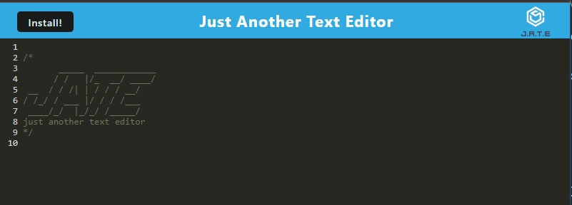
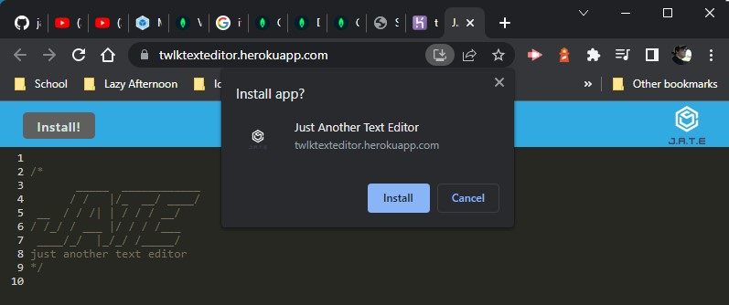

# Text Editor

## Description
- This allows the user to create or test a file in the browser as well as install a standalone application.
- This was build to make editing text files easier and more accessible.
## Table of Contents
- [Installation](#installation)
- [Usage](#usage)
- [Credits](#credits)
- [License](#license)
- [Contribute](#how-to-contribute)
- [Questions](#questions)
- [Screenshots](#screenshots)
- [App](#heroku-app)
- [Repo](#repo-link)
## Installation
Got to the heroku site and click the install button
## Usage
Download the app it will install on your desktop and will open automatically
## Credits
TWelk
## License
MIT
## How to Contribute
If you wish to contribute please contact TWelk
## Questions
* [GitHub Link](https://github.com/TWelk)
* [Contact Me](mailto:twelker08@gmail.com)
## Screenshots
Here is a screenshot of the web application

Here is a screenshot of installing the app

Here is a screenshot of the desktop icon after installing

## Heroku App
* [App](https://twlktexteditor.herokuapp.com/)
## Repo Link
* [Repo](https://github.com/TWelk/TextEditor)